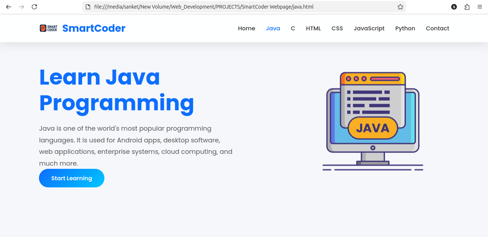
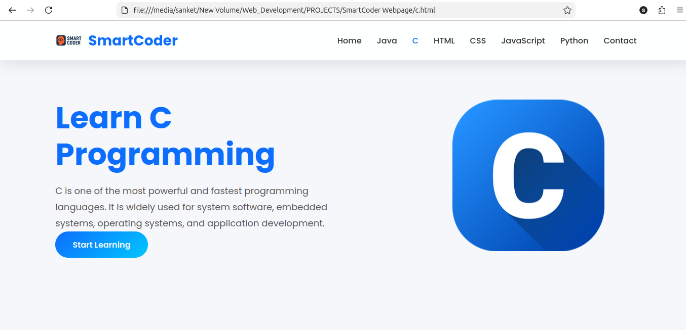
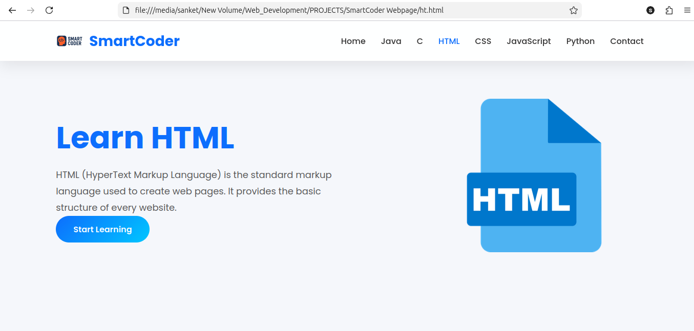
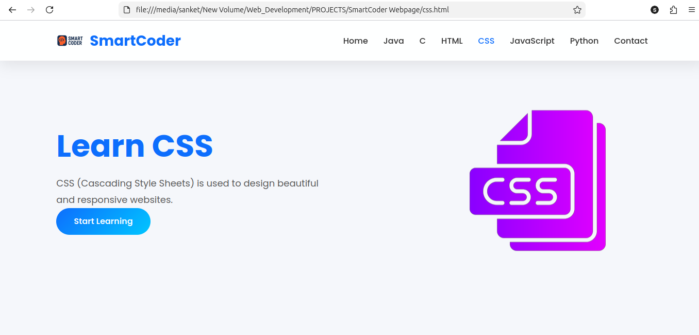
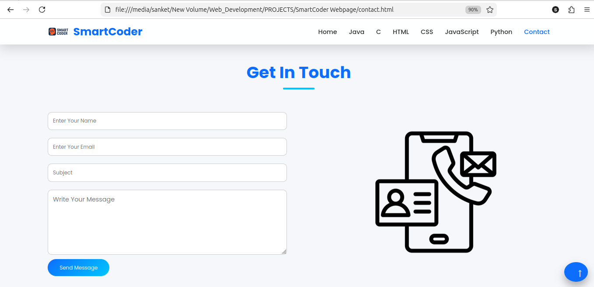

# 🚀 SmartCoder - Programming Learning Website

SmartCoder is a modern, responsive programming learning website built using **HTML, CSS, and JavaScript**.
It helps beginners learn programming languages through clean UI, simple explanations, attractive illustrations, and useful online resources.

---

## 📖 About

SmartCoder is designed for students who want to start learning programming from scratch.
The website provides dedicated pages for popular programming languages with a responsive and user-friendly interface.

---

## ✨ Features

- 🎨 Modern and Responsive UI
- 📱 Mobile-Friendly Design
- 🌈 Beautiful Animations
- 📚 Programming Tutorials
- 💻 Online Compiler Links
- 🖼️ Custom Programming Illustrations
- ⚡ Smooth Navigation
- 🔝 Back-to-Top Button
- 📌 Active Navigation Highlight
- ✨ Scroll Reveal Animation

---

## 🛠️ Technologies Used

- HTML5
- CSS3
- JavaScript
- Font Awesome
- Google Fonts (Poppins)

---

## 📂 Project Structure

```
SmartCoder/
│
├── home.html
├── java.html
├── c.html
├── ht.html
├── css.html
├── js.html
├── python.html
├── contact.html
│
├── css/
│   └── style.css
│
├── js/
│   └── script.js
│
├── Images/
│   ├── logo1.png
│   ├── home-1.png
│   ├── java-1.png
│   ├── c-2.png
│   ├── html-2.png
│   ├── css-2.png
│   ├── js-file-2.png
│   ├── python-file-2.png
│   └── ...
│
└── README.md
```

---

## 📚 Available Courses

- ☕ Java
- 🔷 C Programming
- 🌐 HTML
- 🎨 CSS
- ⚡ JavaScript
- 🐍 Python

---

## 💻 Online Compiler Support

The website provides quick access to online compilers for:

- Java
- C
- Python
- JavaScript

---

## 📱 Responsive Design

The website is optimized for:

- 💻 Desktop
- 💼 Laptop
- 📱 Mobile
- 📲 Tablet

---

## 🚀 How to Run

1. Download or clone this repository.

```bash
git clone https://github.com/sanket-ghayal/SmartCoder.git
```

2. Open the project folder.

3. Run **home.html** in your browser.

---

## 📸 Screenshots
---










---

## 🎯 Future Improvements

- User Login System
- Quiz Section
- Certificates
- Dark Mode
- Search Functionality
- Video Tutorials
- Progress Tracking

---

## 👨‍💻 Developer

**Sanket Ghayal**

BCA Student | Full Stack Web Development Enthusiast

---

## ⭐ Support

If you like this project, don't forget to **Star ⭐ this repository**.

---

## 📄 License

This project is created for educational purposes.

Free to use and modify.
